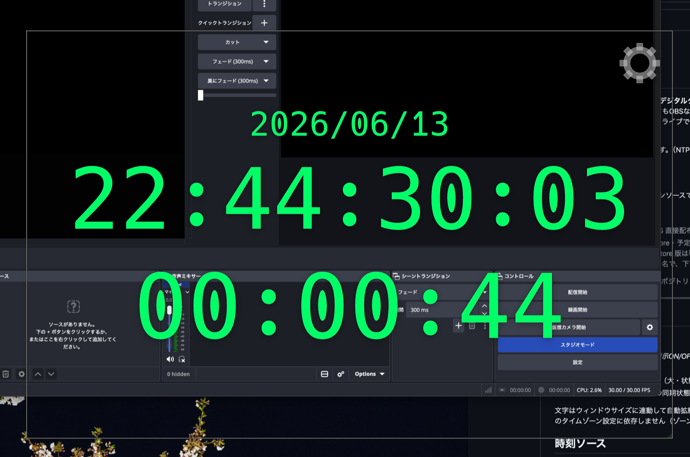

<!-- Language switch (GitHub renders no JS tabs; these links act as language tabs). -->
### 🌐 **English** · [日本語](README.md)

# StreamClock

A **digital clock** designed as a streaming overlay for OBS.
The clock resizes freely and its background ranges from solid black to fully
transparent, so it overlays cleanly on OBS (or anything else) without getting in the
way — even on a cramped screen. It also has a stopwatch that's handy during live
streams. A robust native Rust app built for long, unattended runtime, such as a live
prompter.

It can slave to external time sources (NTP / PTP / MTC / LTC). Because it locks to
LTC/MTC, it doubles as a simple timecode reader.

**Windows / macOS** supported.

Free and open source under the MIT license.



> **Editions** — both are **free**:
> - **Full** (Windows / macOS direct download, Homebrew): System / NTP / PTP / MTC / LTC.
> - **Lite** (macOS App Store, planned): time source limited to **System + NTP** so the
>   build is sandbox-safe and passes review. The App Store build is signed, so it
>   installs with **no Gatekeeper warning** — unlike the directly downloaded full
>   build, which is unsigned and needs the workaround below.
>
> The paid iPad/iPhone edition is a separate, independently-licensed project.

---

## Display

Up to four stacked rows (top to bottom):

1. Date `YYYY/MM/DD` (small) — *toggleable; on by default*
2. Current time `HH:MM:SS` (large)
3. Stopwatch `HH:MM:SS` (large; color changes with state)
4. Status line — sync state of the active source (small) — *toggleable; off by default*

Text scales automatically with the window size (drag the bottom-right grip to
resize). Times are **JST (UTC+9) by default**, independent of the PC's timezone —
the zone is configurable in Settings.

## Time sources

Switch via the **gear icon** (hover the window → top-right) → **Settings**, or the
right-click menu.

| Source | Description |
|--------|-------------|
| System | PC system clock (UTC→local zone) |
| NTP | SNTP periodic sync (default `ntp.nict.jp`, 64 s interval); offset applied |
| PTP | IEEE 1588 (PTPv2) UDP multicast (AES67 / SMPTE ST 2110). Listen-only |
| MTC | MIDI Timecode (quarter-frame + full-frame SysEx; 24/25/29.97/30 auto) |
| LTC | SMPTE LTC decoded from an audio input (biphase-mark, level/polarity independent) |

MTC/LTC freewheel for 2 s after signal loss, then hold the last value and show a
red **NO SIGNAL**. (PTP/MTC/LTC are **Full edition only**.)

## Controls

| Action | Result |
|--------|--------|
| Hover the window | A **gear icon** appears top-right → click to open Settings |
| Drag the text area (except stopwatch) | Move the window |
| Drag the bottom-right grip | Resize (text scales with it) |
| Mouse wheel / ↑↓ | Adjust background (black) opacity |
| **Double-click the stopwatch** | Stop → Reset → Start cycle |
| Right-click | Menu (time source / always-on-top / Settings / Exit) |
| Esc | Exit |

Only the black background is transparent; the text stays opaque. At 0% opacity a
thin outline appears on hover/drag so you can still find the window.

## Settings

- **Time source**, NTP server, PTP domain
- **Inputs**: MTC MIDI port / LTC audio input / NTP NIC / PTP NIC (NIC default = Auto,
  the default-route interface). Device names render correctly even when the OS
  reports them in Japanese or other non-ASCII text.
- **Display toggles**: show the date row (on by default), show frames (`…:FF`)
  separately for the **clock** and the **stopwatch** (both off by default), and show
  the 4th status-line row (off by default).
- **Time zone** — UTC offset in hours, with JST / UTC presets (JST by default).
- Local frame rate (used when not slaved to a timecode source).
- Text color palette (5 presets + free choice), font: Modern / 7-Segment (DSEG7).
- Background opacity, always-on-top.
- "Minimize to taskbar/Dock on close instead of quitting" (right-click → Exit to quit).

Settings auto-save and restore on next launch (including window position/size).

## Build

Install [Rust](https://rustup.rs/), then:

```sh
cargo build --release
```

- **Windows**: `target\release\stream-clock.exe` (MSVC; release builds hide the console).
- **macOS**: `target/release/stream-clock`.

### macOS universal `.app` (both editions)

`./deploy.sh` builds **universal (arm64 + x86_64)** `.app` bundles for both editions
and can install the full build:

```sh
./deploy.sh build     # → dist/full/StreamClock.app + dist/appstore/StreamClock.app
./deploy.sh install   # install the full build to /Applications  (or: ./deploy.sh all)
```

Requires `rustup` with the `aarch64-apple-darwin` and `x86_64-apple-darwin` targets,
plus `cargo install cargo-bundle`. The full bundle's `Info.plist` includes
`NSMicrophoneUsageDescription` (needed for LTC audio input).

The directly-downloaded macOS build is **unsigned**, so Gatekeeper blocks it on first
launch. Either right-click → Open, or:

```sh
xattr -dr com.apple.quarantine /Applications/StreamClock.app
```

(The App Store Lite edition is signed, so it has no such warning.)

> On Windows 11, Smart App Control can block running unsigned binaries (including
> cargo build scripts), error `os error 4551`. Turn it off on the dev machine.

## Tests

```sh
cargo test
```

LTC decoder round-trips (30 fps/48 kHz, 25 fps/44.1 kHz, low level, inverted
polarity, false-sync resistance), MTC quarter-frame assembly, PTP packet parsing,
and NTP timestamp conversion are covered.

## Layout

```
src/
  main.rs  — GUI (eframe/egui), settings persistence, stopwatch, NIC enumeration
  tc.rs    — SMPTE timecode type
  ntp.rs   — SNTP client (self-contained)
  ptp.rs   — PTPv2 listener (self-contained)
  mtc.rs   — MTC receiver (midir)        [full-sources feature]
  ltc.rs   — LTC decoder (cpal + biphase-mark) [full-sources feature]
assets/fonts — DSEG7 Classic Bold (embedded)
legacy/    — old PowerShell+WPF version (v0.1, reference only)
deploy.sh  — macOS universal build + bundle + install
```

The **Lite / App Store** build is produced with `cargo build --release
--no-default-features`, which compiles out PTP/MTC/LTC and their dependencies
(midir/cpal) so the result is sandbox-safe.

## License

This project is licensed under the **[MIT License](LICENSE)**.

It embeds the **DSEG7 Classic** font © 2017 keshikan, under the **SIL Open Font
License 1.1** (`assets/fonts/DSEG-LICENSE.txt`). Other third-party components are
listed in [THIRD-PARTY-NOTICES.md](THIRD-PARTY-NOTICES.md). The separate paid
iPad/iPhone edition is licensed independently and is not covered by this license.
